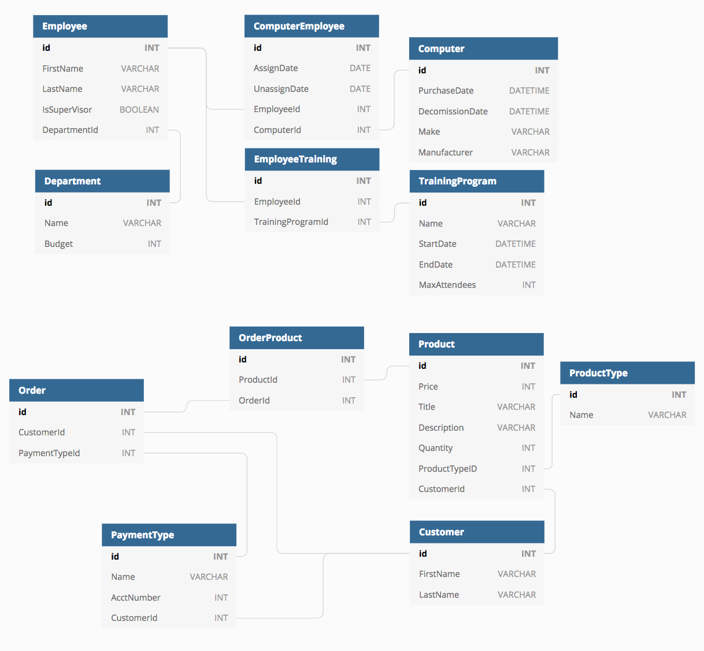

# BangazonAPI
Welcome to **Bangazon!** The new virtual marketplace. This marketplace allows customers to buy and sell their products through 
a single-page application webpage and its data is tracked through a powerful, hand-crafted and solely dedicated API. 

## Table of Contents
- Software Requirements
- Entity Relationship Diagram
- Database Setup
- Http Request Methods:
1. Customer
1. Product
1. Payment Type
1. Order
1. Product Type
1. Employee
1. Department
1. Computer
1. Training Program

## Software Requirements
- Sql Server Manangment Studio
- Visual Studio Community 2017
- Postman
- Google Chrome

## Enitity Relationship Diagram

## Database Setup
(to be added)

## Http Request Methods

### 1. Customer

**GET**

**POST**

**PUT**

**DELETE**

### 2. Product

**GET**

**POST**

**PUT**

**DELETE**

### 3. Payment Type

**GET**

**POST**

**PUT**

**DELETE**

### 4. Order

**GET**

**POST**

**PUT**

**DELETE**

### 5. Product Type

**GET**

**POST**

**PUT**

**DELETE**

### 6. Employee

**GET**

**POST**

**PUT**

**DELETE**

### 7. Department

**GET**

**POST**

**PUT**

**DELETE**

### 8. Computer

**GET**

**POST**

**PUT**

**DELETE**

### 9. Training Program

**GET**

**POST**

**PUT**

**DELETE**
